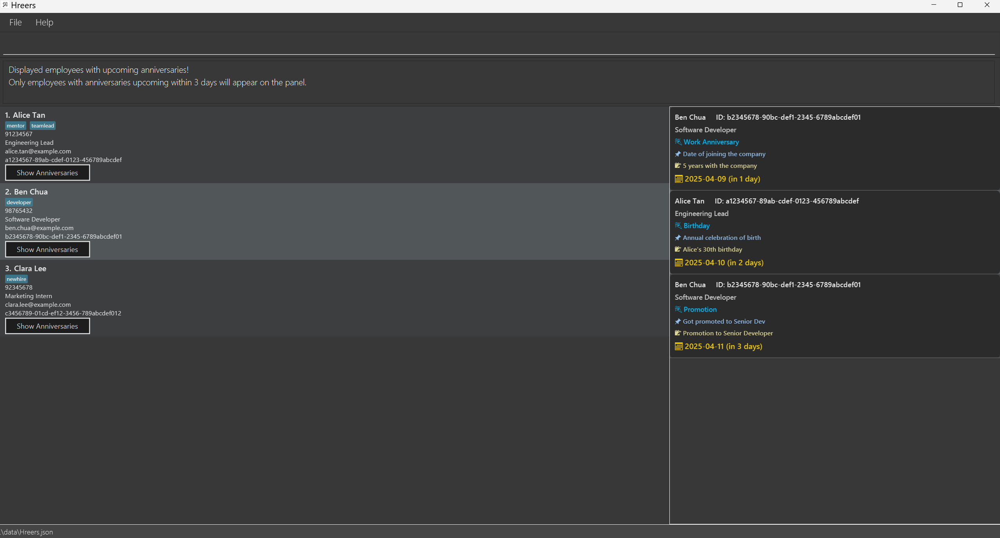

Certainly! Below is the updated user guide with the product name changed to `H'Reers` and formatted in GitHub Markdown syntax.

---

## User Guide

Welcome to `H'Reers`, a **desktop app for managing contacts, optimized for use via a Command Line Interface** (CLI) while still having the benefits of a Graphical User Interface (GUI). If you can type fast, `H'Reers` can get your contact management tasks done faster than traditional GUI apps.

### Table of Contents
- [Quick Start](#quick-start)
- [Features](#features)
    - [Viewing Help](#viewing-help--help)
    - [Adding a Person](#adding-a-person--add)
    - [Listing All Persons](#listing-all-persons--list)
    - [Editing a Person](#editing-a-person--edit)
    - [Locating Persons by Name](#locating-persons-by-name--find)
    - [Deleting a Person](#deleting-a-person--delete)
    - [Clearing All Entries](#clearing-all-entries--clear)
    - [Exiting the Program](#exiting-the-program--exit)
    - [Saving the Data](#saving-the-data)
    - [Editing the Data File](#editing-the-data-file)
- [FAQ](#faq)
- [Known Issues](#known-issues)
- [Command Summary](#command-summary)

---

## Quick Start

1. Ensure you have Java `17` or above installed on your computer.
    - **Mac users:** Ensure you have the precise JDK version prescribed [here](https://se-education.org/guides/tutorials/javaInstallationMac.html).

2. Download the latest `.jar` file from [here](https://github.com/se-edu/addressbook-level3/releases).

3. Copy the file to the folder you want to use as the _home folder_ for your `H'Reers`.

4. Open a command terminal, `cd` into the folder you put the jar file in, and use the `java -jar addressbook.jar` command to run the application.
    - A GUI similar to the below should appear in a few seconds. Note how the app contains some sample data.
      

5. Type the command in the command box and press Enter to execute it. e.g. typing **`help`** and pressing Enter will open the help window.
    - Some example commands you can try:
        - `list` : Lists all contacts.
        - `add n/John Doe p/98765432 e/johnd@example.com a/John street, block 123, #01-01` : Adds a contact named `John Doe` to `H'Reers`.
        - `delete 3` : Deletes the 3rd contact shown in the current list.

---

## Features

### Viewing Help : `help`

Shows a message explaining how to access the help page.

**Format:** `help`

### Adding a Person : `add`

Adds a person to the address book.

**Format:** `add n/NAME p/PHONE_NUMBER e/EMAIL a/ADDRESS [t/TAG]…​`

**Examples:**
- `add n/John Doe p/98765432 e/johnd@example.com a/John street, block 123, #01-01`
- `add n/Betsy Crowe t/friend e/betsycrowe@example.com a/Newgate Prison p/1234567 t/criminal`

### Listing All Persons : `list`

Shows a list of all persons in the address book.

**Format:** `list`

### Editing a Person : `edit`

Edits an existing person in the address book.

**Format:** `edit INDEX [n/NAME] [p/PHONE] [e/EMAIL] [a/ADDRESS] [t/TAG]…​`

- Edits the person at the specified `INDEX`. The index refers to the index number shown in the displayed person list. The index **must be a positive integer** 1, 2, 3, …​
- At least one of the optional fields must be provided.
- Existing values will be updated to the input values.
- When editing tags, the existing tags of the person will be removed i.e adding of tags is not cumulative.
- You can remove all the person’s tags by typing `t/` without specifying any tags.

**Examples:**
- `edit 1 p/91234567 e/johndoe@example.com` Edits the phone number and email address of the 1st person to be `91234567` and `johndoe@example.com` respectively.
- `edit 2 n/Betsy Crower t/` Edits the name of the 2nd person to be `Betsy Crower` and clears all existing tags.

### Locating Persons by Name : `find`

Finds persons whose names contain any of the given keywords.

**Format:** `find KEYWORD [MORE_KEYWORDS]`

- The search is case-insensitive. e.g `hans` will match `Hans`
- The order of the keywords does not matter. e.g. `Hans Bo` will match `Bo Hans`
- Only the name is searched.
- Only full words will be matched e.g. `Han` will not match `Hans`
- Persons matching at least one keyword will be returned (i.e. `OR` search).

**Examples:**
- `find John` returns `john` and `John Doe`
- `find alex david` returns `Alex Yeoh`, `David Li`

### Deleting a Person : `delete`

Deletes the specified person from the address book.

**Format:** `delete INDEX`

- Deletes the person at the specified `INDEX`.
- The index refers to the index number shown in the displayed person list.
- The index **must be a positive integer** 1, 2, 3, …​

**Examples:**
- `list` followed by `delete 2` deletes the 2nd person in the address book.
- `find Betsy` followed by `delete 1` deletes the 1st person in the results of the `find` command.

### Clearing All Entries : `clear`

Clears all entries from the address book.

**Format:** `clear`

### Exiting the Program : `exit`

Exits the program.

**Format:** `exit`

### Saving the Data

`H'Reers` data are saved in the hard disk automatically after any command that changes the data. There is no need to save manually.

### Editing the Data File

`H'Reers` data are saved automatically as a JSON file `[JAR file location]/data/addressbook.json`. Advanced users are welcome to update data directly by editing that data file.

**Caution:** If your changes to the data file make its format invalid, `H'Reers` will discard all data and start with an empty data file at the next run. Hence, it is recommended to take a backup of the file before editing it. Furthermore, certain edits can cause `H'Reers` to behave in unexpected ways (e.g., if a value entered is outside of the acceptable range). Therefore, edit the data file only if you are confident that you can update it correctly.

---

## FAQ

**Q**: How do I transfer my data to another computer? 
**A**: Install the app on the other computer and overwrite the empty data file it creates with the file that contains the data of your previous `H'Reers` home folder.

---

## Known Issues

1. **When using multiple screens**, if you move the application to a secondary screen, and later switch to using only the primary screen, the GUI will open off-screen. The remedy is to delete the `preferences.json` file created by the application before running the application again.
2. **If you minimize the Help Window** and then run the `help` command (or use the `Help` menu, or the keyboard shortcut `F1`) again, the original Help Window will remain minimized, and no new Help Window will appear. The remedy is to manually restore the minimized Help Window.

---

## Command Summary

| Action | Format, Examples |
|--------|------------------|
| **Add** | `add n/NAME p/PHONE_NUMBER e/EMAIL a/ADDRESS [t/TAG]…​`   e.g., `add n/James Ho p/22224444 e/jamesho@example.com a/123, Clementi Rd, 1234665 t/friend t/colleague` |
| **Clear** | `clear` |
| **Delete** | `delete INDEX`  e.g., `delete 3` |
| **Edit** | `edit INDEX [n/NAME] [p/PHONE_NUMBER] [e/EMAIL] [a/ADDRESS] [t/TAG]…​`  e.g.,`edit 2 n/James Lee e/jameslee@example.com` |
| **Find** | `find KEYWORD [MORE_KEYWORDS]`  e.g., `find James Jake` |
| **List** | `list` |
| **Help** | `help` |

---

This user guide provides a comprehensive overview of the features and commands available in `H'Reers`. Follow the instructions and examples provided to effectively manage your contacts using the application.